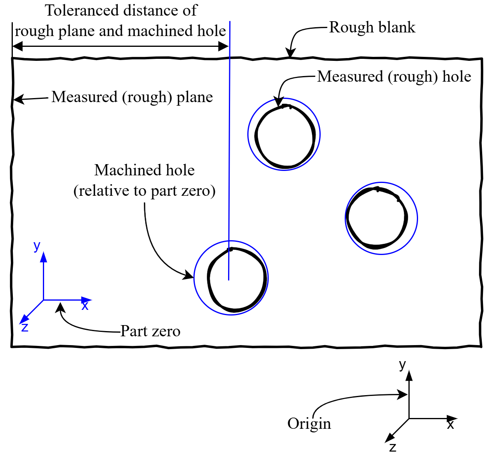

# Short 2D example

A shorter 2D example is introduced in this section.
It provides the basics for easier understanding of the [Complex 3D example](@ref).

## Part description

The task is to find optimal positions for drilling the three holes on one side of the part.
The three holes are machined in one operation: the machining poses are defined to a common part zero.
The distance of the holes and another side of the part is toleranced (only along one, the x axis).
In this example we are searching the optimal x value of the part zero (and are ignoring the y-z values for simplicity).
We mean optimal in the sense that, 1) material must be removed at every hole (the blue circles must cover the black ones with enough margin called machining allowance) and 2) the toleranced distances between the left plane and the holes should be as close to the center of the tolerance fields as possible.
Please note, that the package is designed for 3D usage, therefore the geometry defintions need to have all coordinates defined (even though this example is a planar problem).



## Package installations

The BlankLocalizationCore package and one solver (Ipopt, Xpress, etc.) needs to be installed to use the package.

```julia
using Pkg
Pkg.add(["BlankLocalizationCore", "Ipopt"])
```

## Model construction

After `using` the package, we can move on the model building:

```julia
using BlankLocalizationCore
```

Please note, that the package uses 3D geometry 

First, the part zero is created with the following line:

```julia
# partzero relative to origin:
# translation: zero, will be calculated by optimization
# orientation: given as rotation matrices
pz_holes = PartZero("pz-holes", [0,0,0], hcat([1,0,0], [0,1,0], [0,0,1]))
```

### Machined geometries

The CNC code for the holes is modeled with cylinders.
A [`SimpleHole`](@ref) struct stores the position of a cylinder relative to the part zero and its radius.

```julia
# machined features: 3 holes + 1 plane
h1 = SimpleHole([62, 7, 0], 11.5)
h2 = SimpleHole([80, 52, 0], 13)
h3 = SimpleHole([108, 26, 0], 12.5)
p1 = SimplePlane([0, 0, 0]) # this is just a dummy machined plane for the left side
```

The left side of the part is not machined in this example, but a dummy variable is needed for the modeling, hence the above `SimplePlane` definition.

### Rough geometries

Similarly, the to-be-machined (rough) geometries are also defined as primitive geometries.
Their position is relative to the origin.

```julia
# rough features: 3 holes and left side of the part are measured geometries for the model
# measured relative to origin
rh1 = HoleAndNormal([-56.79, 44.235, 0], [0, 0, -1], 11.2)
rh2 = HoleAndNormal([-38.79, 89.235, 0], [0, 0, -1], 12.8)
rh3 = HoleAndNormal([-10.79, 63.235, 0], [0, 0, -1], 12.2)
rp1 = PlaneAndNormal([-125.67, 66, 0], [-1, 0, 0])
```

The machined and rough geometries are connected via [`FeatureDescriptor`](@ref)s, that defines the name of the feature, and also if it is machined and if it has a rough geometry (for cases when holes don't have cast holes on the blank).

Then, from the rough, machined geometries and feature descriptors the [`LocalizationFeature`](@ref)s are constructed.

```julia
# feature descriptors
fd1 = FeatureDescriptor("hole1", pz_holes, true, true)
fd2 = FeatureDescriptor("hole2", pz_holes, true, true)
fd3 = FeatureDescriptor("hole3", pz_holes, true, true)
fd4 = FeatureDescriptor("left-plane", pz_holes, false, true)

holes = [
    HoleLocalizationFeature(fd1, rh1, h1),
    HoleLocalizationFeature(fd2, rh2, h2),
    HoleLocalizationFeature(fd3, rh3, h3),
]

planes = [
    PlaneLocalizationFeature(fd4, rp1, p1)
]
```

### Tolerances

`Tolerance`s are defined as lower-upper bounds on the distance of two features.
One needs to define the names of the features, if their rough or machined "form" is toleranced and also along which axis is their distance toleranced.
The nominal, lower and upper values are self-explanatory and a comment can be also added as a string.

```julia
xfunc(x) = x[1]
tolerances = [
    Tolerance("hole1", true, xfunc, "left-plane", false, 69, 68.5, 69.5, ""),
    Tolerance("hole2", true, xfunc, "left-plane", false, 87, 86.7, 87.3, ""),
    Tolerance("hole3", true, xfunc, "left-plane", false, 115, 114.8, 115.2, "")
]
```

## Solving the optimization model

### Building and solving the optimization model

A parameter dictionary is used to store some parameters (all parameters are listed in the longer example's `Constructing and solving the optimization problem` section):

| Name (key) | Description | Suggested value | Required? |
| :--- | :---  | --- | --- |
| minAllowance | Minimum allowance that must be achieved even by the lowest value. | `0.1` | Required |
| OptimizeForToleranceCenter | The default method is to optimize for the middle (center) of the tolerance fields. For debugging, one can set it to `false`, then the minimum allowance will be maximised (ignoring the `minAllowance` value). | `true` | Required |
| UseTolerances | Also a debugging feature. Tolerance lower-upper values are added as active constraints on the distance of the corresponding features. This can be turned off with this flag. | `true` | Required |
| maxPlaneZAllowance | The allowance has no upper bound by default. For planes, it is possible to set an upper bound to avoid the issue of "machining the whole part away". | | Optional |

```julia
## Constructing and solving the optimization problem
pard = Dict("minAllowance"=>0.1, "OptimizeForToleranceCenter"=>true,
    "UseTolerances"=>true, "maxPlaneZAllowance"=>1);

mop = MultiOperationProblem([pz_holes], holes, planes, tolerances, pard)

import Ipopt # or Xpress if you have a license
optimizeproblem!(mop, Ipopt.Optimizer)
```

### Result evaluation

The results can be evaluated with the `printpartzeropositions`, `printallowancetable` and `printtolerancetable` functions.
After running the above examples, the output of these functions should be:

```julia-repl
julia> printpartzeropositions(mop)
pz-holes: [-118.68950122461291, 37.23499999999999, 0.0]

julia> printallowancetable(mop)
                                                        Allowance table Min allowance radial: 0.100 axial: NaN
┌────────────┬──────────────┬───────────┬───────────┬───────────┬─────────┬────────┬────────┬───────────┬────────┬────────────┬───────────┬────────────┬─────────────┐
│       name │ partzeroname │ machinedx │ machinedy │ machinedz │  roughx │ roughy │ roughz │ machinedr │ roughr │ xydistance │ zdistance │ rallowance │ axallowance │
├────────────┼──────────────┼───────────┼───────────┼───────────┼─────────┼────────┼────────┼───────────┼────────┼────────────┼───────────┼────────────┼─────────────┤
│      hole1 │     pz-holes │  -56.6895 │    44.235 │       0.0 │  -56.79 │ 44.235 │    0.0 │      11.5 │   11.2 │   0.100499 │           │   0.199501 │             │
│      hole2 │     pz-holes │  -38.6895 │    89.235 │       0.0 │  -38.79 │ 89.235 │    0.0 │      13.0 │   12.8 │   0.100499 │           │  0.0995012 │             │
│      hole3 │     pz-holes │  -10.6895 │    63.235 │       0.0 │  -10.79 │ 63.235 │    0.0 │      12.5 │   12.2 │   0.100499 │           │   0.199501 │             │
│ left-plane │     pz-holes │           │           │           │ -125.67 │   66.0 │    0.0 │           │        │            │           │            │             │
└────────────┴──────────────┴───────────┴───────────┴───────────┴─────────┴────────┴────────┴───────────┴────────┴────────────┴───────────┴────────────┴─────────────┘

julia> printtolerancetable(mop)
                                                   Tolerance table avgabsreltolerror: 6.7%
┌───────┬──────────┬───────────┬──────────────┬───────────┬──────────┬────────┬────────┬─────────────────────────┬─────────┬────────────────┐
│ Tol # │ feature1 │ partzero1 │     feature2 │ partzero2 │ nominald │ lowerd │ upperd │                distance │   reald │ tolerancefield │
├───────┼──────────┼───────────┼──────────────┼───────────┼──────────┼────────┼────────┼─────────────────────────┼─────────┼────────────────┤
│     1 │  M hole1 │  pz-holes │ R left-plane │  pz-holes │     69.0 │   68.5 │   69.5 │ [68.9805, -21.765, 0.0] │ 68.9805 │         -3.9 % │
│     2 │  M hole2 │  pz-holes │ R left-plane │  pz-holes │     87.0 │   86.7 │   87.3 │  [86.9805, 23.235, 0.0] │ 86.9805 │         -6.5 % │
│     3 │  M hole3 │  pz-holes │ R left-plane │  pz-holes │    115.0 │  114.8 │  115.2 │   [114.98, -2.765, 0.0] │  114.98 │         -9.8 % │
└───────┴──────────┴───────────┴──────────────┴───────────┴──────────┴────────┴────────┴─────────────────────────┴─────────┴────────────────┘
```

### Visualization

For visualization one needs to install the Meshes and Makie packages:

```julia
Pkg.add(["Meshes", "GLMakie"])
```

Then the "visualization geometries" can be generated and displayed:

```julia
rholes = genroughholes(mop)
mholes = genmachinedholes(mop)
mplanes = genmachinedplanes(mop)
rplanes = genroughplanes(mop)

f = initviz(hideaxes=false)
viz!.(rholes, alpha=0.5, color=:red)
viz!.(mholes, alpha=0.5, color=:blue)
viz!.(rplanes, alpha=0.5, color=:red)
viz!.(mplanes, alpha=0.5, color=:blue)
```
