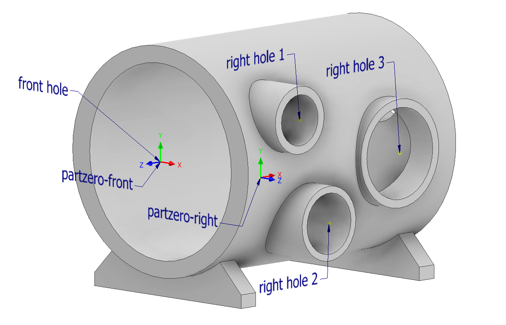
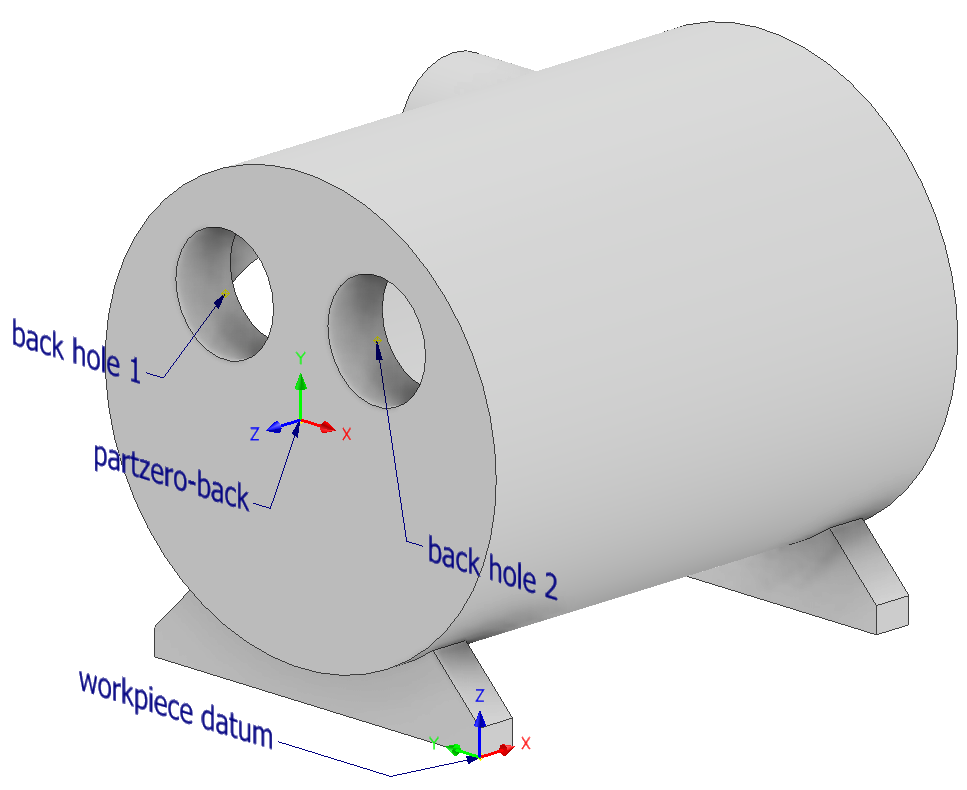
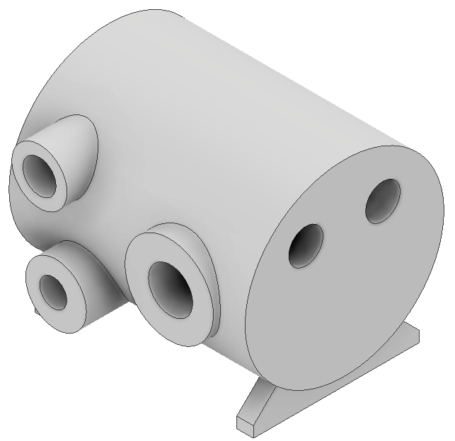
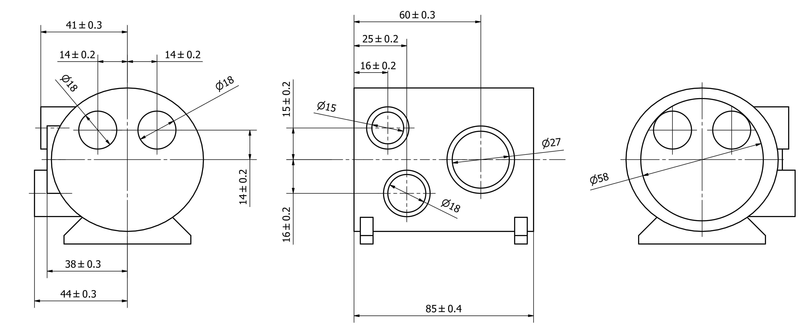
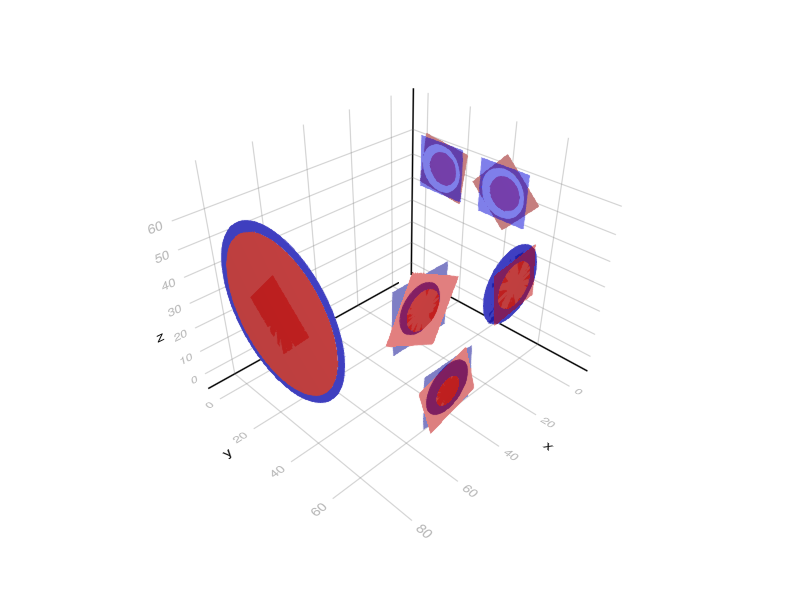

# Example

This example can be found as a single file in the repository under the `examples` folder.
The only difference is, that the file uses the [Ipopt](https://github.com/jump-dev/Ipopt.jl) package for solving the optimization.

## Example part

The following part is crafted for demonstrating purposes.
The CAD filesa are available here: [machined](assets/example-part-machined.stl) and [rough](assets/example-part-rough.stl).
The two images below show the part from its "front" and "back" sides in its machined state.





All six holes needs to be machined and also their front faces, which means that there are six machined planes.

The part in its rough (to be machined) state is shown below:




The rough part is also designed in CAD, of course in production the dimensions of the rough part come from a measurement process.
It can be seen, that the holes on the rough part are smaller, and their axes' are also modified a little bit in a few cases to showcase the possibilities of the algorithm.

## Part zeros

There are three part zeros, their attributes are listed in the table below.
Their axes' are shown relative to the workpiece datum.

| Part zero name | x axis | y axis | z axis |
| --- | --- | --- | --- |
| front | y | z | x |
| right | -x | z | y |
| back | -y | z | -x |

They can be defined in julia like this.

```julia
using BlankLocalizationCore

## Part zero definitions

pzf = PartZero("front", [0,0,0], hcat([0,1,0], [0,0,1], [1,0,0]))
pzr = PartZero("right", [0,0,0], hcat([-1, 0, 0], [0, 0, 1], [0, 1, 0]))
pzb = PartZero("back", [0,0,0], hcat([0, -1, 0], [0, 0, 1], [-1, 0, 0]))

partzeros = [pzf, pzr, pzb]
```

When constructing a part zero, a default `[0,0,0]` position is set, as the goal of the optimization process is to find the values of those position.
For more details see the docs of [`PartZero`](@ref).

## Machined features

The following are the features' positions (six holes and six faces):

| Name | Part zero name | Position (relative to part zero) | Radius (if hole) |
| --- | --- | --- | --- |
| front hole | front | [0, 0, 0] | 29 |
| front face | front | [0, 0, 0] |  |
| right hole 1 | right | [16, 15, 0] | 7.5 |
| right hole 2 | right | [25, -16, 3] | 9 |
| right hole 3 | right | [60, 0, -3] | 13.5 |
| right face 1 | right | [16, 15, 0] |  |
| right face 2 | right | [25, -16, 3] |  |
| right face 3 | right | [60, 0, -3] |  |
| back hole 1 | back | [-14, 14, 0] | 9 |
| back hole 2 | back | [14, 14, 0] | 9 |
| back face 1 | back | [-14, 14, 0] |  |
| back face 2 | back | [14, 14, 0] |  |

The machined geometries are represented with primitive features, and can be done this way:

```julia
## Machined geometry definitions

fronthole_m = SimpleHole([0, 0, 0], 29)
frontface_m = SimplePlane([0, 0, 0])

righthole1_m = SimpleHole([16, 15, 0], 7.5)
righthole2_m = SimpleHole([25, -16, 3], 9)
righthole3_m = SimpleHole([60, 0, -3], 13.5)
rightface1_m = SimplePlane([16, 15, 0])
rightface2_m = SimplePlane([25, -16, 3])
rightface3_m = SimplePlane([60, 0, -3])

backhole1_m = SimpleHole([-14, 14, 0], 9)
backhole2_m = SimpleHole([14, 14, 0], 9)
backface1_m = SimplePlane([-14, 14, 0])
backface2_m = SimplePlane([14, 14, 0])
```

Holes are defined with their CNC machining position relative to their corresponding part zero, and their radius.
Planes are defined with their position relative to their part zero.
Orientation of the hole axes and plane normals are defined by their part zero (z axis).

## Rough features

The rough features are measured relative to the workpiece datum and are listed below.

| Name | Position (relative to part zero) | Radius (if hole) |
| --- | --- | --- |
| front hole | [82.5, 30, 40] | 26 |
| front face | [82.5, 30, 40] |  |
| right hole 1 | [66, 71.5, 55] | 6 |
| right hole 2 | [58, 74.5, 24] | 4.905 |
| right hole 3 | [21.5, 68.5, 40] | 16 |
| right face 1 | [66, 71.5, 55] |  |
| right face 2 | [58, 74.5, 24] |  |
| right face 3 | [21.5, 68.5, 40] |  |
| back hole 1 | [-3, 44, 53.9] | 6.2 |
| back hole 2 | [-3, 16.1, 54] | 6.25 |
| back face 1 | [-3, 44, 54] |  |
| back face 2 | [-3, 16, 54] |  |

In julia we define primitive features just like before.
Note that a plane normal is given, that is only used later when visualizing the planes.

```julia
## Rough geometry definitions

fronthole_r = SimpleHole([82.5, 30, 40], 26)
frontface_r = PlaneAndNormal([82.5, 30, 40], [1, 0, 0])

righthole1_r = SimpleHole([66, 71.5, 55], 6)
righthole2_r = SimpleHole([58, 74.5, 24], 4.905)
righthole3_r = SimpleHole([21.5, 68.5, 40], 8)
rightface1_r = PlaneAndNormal([66, 71.5, 55], [0, 1, 0])
rightface2_r = PlaneAndNormal([58, 74.5, 24], [0, 1, 0])
rightface3_r = PlaneAndNormal([21.5, 68.5, 40], [0, 1, 0])

backhole1_r = SimpleHole([-3, 44, 53.9], 6.2)
backhole2_r = SimpleHole([-3, 16.1, 54], 6.25)
backface1_r = PlaneAndNormal([-3, 44, 54], [-1, 0, 0])
backface2_r = PlaneAndNormal([-3, 16, 54], [-1, 0, 0])
```

## Pairing the rough and machined features

To create [`LocalizationFeature`](@ref)s, that will be subject to the optimizatio, a [`FeatureDescriptor`](@ref) is needed to be defined for each.
This "joins" a rough and machined geometry, and contains information such as the name and part zero of the feature and if a feature has a machined and rough state.
(There are cases, when this can be important, for this example all features have machined and rough state).

This will look like this in julia:

```julia
## Geometry pairing and feature descriptors

# Feature descriptors for each feature

fd_fronthole = FeatureDescriptor("fronthole", pzf, true, true)
fd_frontface = FeatureDescriptor("frontface", pzf, true, true)

fd_righthole1 = FeatureDescriptor("righthole1", pzr, true, true)
fd_righthole2 = FeatureDescriptor("righthole2", pzr, true, true)
fd_righthole3 = FeatureDescriptor("righthole3", pzr, true, true)
fd_rightface1 = FeatureDescriptor("rightface1", pzr, true, true)
fd_rightface2 = FeatureDescriptor("rightface2", pzr, true, true)
fd_rightface3 = FeatureDescriptor("rightface3", pzr, true, true)

fd_backhole1 = FeatureDescriptor("backhole1", pzb, true, true)
fd_backhole2 = FeatureDescriptor("backhole2", pzb, true, true)
fd_backface1 = FeatureDescriptor("backface1", pzb, true, true)
fd_backface2 = FeatureDescriptor("backface2", pzb, true, true)

# Hole features

holes = [HoleLocalizationFeature(fd_fronthole, fronthole_r, fronthole_m),
    HoleLocalizationFeature(fd_righthole1, righthole1_r, righthole1_m),
    HoleLocalizationFeature(fd_righthole2, righthole2_r, righthole2_m),
    HoleLocalizationFeature(fd_righthole3, righthole3_r, righthole3_m),
    HoleLocalizationFeature(fd_backhole1, backhole1_r, backhole1_m),
    HoleLocalizationFeature(fd_backhole2, backhole2_r, backhole2_m)
    ]

# Face features
planes = [PlaneLocalizationFeature(fd_frontface, frontface_r, frontface_m),
PlaneLocalizationFeature(fd_rightface1, rightface1_r, rightface1_m),
PlaneLocalizationFeature(fd_rightface2, rightface2_r, rightface2_m),
PlaneLocalizationFeature(fd_rightface3, rightface3_r, rightface3_m),
PlaneLocalizationFeature(fd_backface1, backface1_r, backface1_m),
PlaneLocalizationFeature(fd_backface2, backface2_r, backface2_m)
]
```

## Tolerances

A tolerance is described between two feature (their feature point to be precise), and their distance is calculated with a certain projection (usually projection to one of the axis of the workpiece datum, but any R^3->R transformation can be used).
This projected distance must be between the lower and upper values of the tolerance.
Tolerance can be defined between both rough and/or machined features.

For this example, the tolerances are created based on the drawing of the machined part.
This is the drawing, which only contains dimensions related to the optimization problem.
It is also available as a pdf [here](assets/example-part-machined-tolerances.pdf).



Axes in the "Pojection" column mean the axes of the workpiece datum.
The distance of the two features' feature points are projected to those axes.

| {#} | F1 name | F1: machined/rough | Projection | F2 name | F2: machined/rough | Nominal value | Lower value | Upper value |
| --- | --- | --- | --- | --- | --- | --- | --- | --- |
| 1 | right face 1 | machined | y axis | front hole | machined | 41 | 40.7 | 41.3 |
| 2 | back hole 1 | machined | y axis | front hole | machined | 14 | 13.8 | 14.2 |
| 3 | front hole | machined | y axis | back hole 2 | machined | 14 | 13.8 | 14.2 |
| 4 | back hole 1 | machined | z axis | front hole | machined | 14 | 13.8 | 14.2 |
| 5 | back hole 2 | machined | z axis | front hole | machined | 14 | 13.8 | 14.2 |
| 6 | right face 3 | machined | y axis | front hole | machined | 38 | 37.7 | 38.3 |
| 7 | right face 2 | machined | y axis | front hole | machined | 44 | 43.7 | 44.3 |
| 8 | front face | machined | x axis | right hole 3 | machined | 60 | 59.7 | 60.3 |
| 9 | front face | machined | x axis | right hole 2 | machined | 25 | 24.8 | 25.2 |
| 10 | front face | machined | x axis | right hole 1 | machined | 16 | 15.8 | 16.2 |
| 11 | right hole 1 | machined | z axis | front hole | machined | 15 | 14.8 | 15.2 |
| 12 | front hole | machined | z axis | right hole 2 | machined | 16 | 15.8 | 16.2 |
| 13 | front face | machined | x axis | back face 1 | rough | 85 | 84.6 | 85.4 |
| 14 | front face | machined | x axis | back face 2 | rough | 85 | 84.6 | 85.4 |
| 15 | right hole 3 | machined | z axis | front hole | machined | 0 | -0.2 | 0.2 |

To express these tolerances in julia, the following code is used.
The above table is changed with the followings:

* Those feature names are used, that we defined in the `FeatureDescriptor`s.
* Where the machined state of a feature is used, a `true` used, and `false` for rough state.
* Three functions are defined that do the projection: `xfunc`, `yfunc`, `zfunc`. Those are passed to the struct constructor.
* The julia struct also contains a note string, the numbering of the tolerances are given there for this example.

```julia
## Tolerances

xfunc(x) = x[1]
yfunc(x) = x[2]
zfunc(x) = x[3]

tolerances = [Tolerance("rightface1", true, yfunc, "fronthole", true, 41, 40.7, 41.3, "1"),
Tolerance("backhole1", true, yfunc, "fronthole", true, 14, 13.8, 14.2, "2"),
Tolerance("fronthole", true, yfunc, "backhole2", true, 14, 13.8, 14.2, "3"),
Tolerance("backhole1", true, zfunc, "fronthole", true, 14, 13.8, 14.2, "4"),
Tolerance("backhole2", true, zfunc, "fronthole", true, 14, 13.8, 14.2, "5"),
Tolerance("rightface3", true, yfunc, "fronthole", true, 38, 37.7, 38.3, "6"),
Tolerance("rightface2", true, yfunc, "fronthole", true, 44, 43.7, 44.3, "7"),
Tolerance("frontface", true, xfunc, "righthole3", true, 60, 59.7, 60.3, "8"),
Tolerance("frontface", true, xfunc, "righthole2", true, 25, 24.8, 25.2, "9"),
Tolerance("frontface", true, xfunc, "righthole1", true, 16, 15.8, 16.2, "10"),
Tolerance("righthole1", true, zfunc, "fronthole", true, 15, 14.8, 15.2, "11"),
Tolerance("fronthole", true, zfunc, "righthole2", true, 16, 15.8, 16.2, "12"),
Tolerance("frontface", true, xfunc, "backface1", false, 85, 84.6, 85.4, "13"),
Tolerance("frontface", true, xfunc, "backface2", false, 85, 84.6, 85.4, "14"),
Tolerance("righthole3", true, zfunc, "fronthole", true, 0, -0.2, 0.2, "15")]
```

## Constructing and solving the optimization problem

A few parameters are needed for the optimization problem, passed to the object as a dictionary.
These are:

| Name (key) | Description | Suggested value | Required? |
| :--- | :---  | --- | --- |
| minAllowance | Minimum allowance that must be achieved even by the lowest value. | `0.1` | Required |
| OptimizeForToleranceCenter | The default method is to optimize for the middle (center) of the tolerance fields. For debugging, one can set it to `false`, then the minimum allowance will be maximised (ignoring the `minAllowance` value). | `true` | Required |
| UseTolerances | Also a debugging feature. Tolerance lower-upper values are added as active constraints on the distance of the corresponding features. This can be turned off with this flag. | `true` | Required |
| SetPartZeroPosition | The position of each part zero can be set with this option. A vector of 3 long vectors is expected, that is matched with the number of part zeros. Empty vectors can be passed, if not all part zero positions should be set. For example setting this option to `[[], [], []]` for three part zeros will have no effect. `NaN` elements are ignored, which means that specific axes of part zeros can be set. For example `[[NaN, 150, Nan], [], []]` would only set the value of the Y axis of the first part zero, all others are unaffected. | | Optional |
| maxPlaneZAllowance | The allowance has no upper bound by default. For planes, it is possible to set an upper bound to avoid the issue of "machining the whole part away". | | Optional |

We need to load the JuMP package and also an optimizer.
For the papers we used FICO Xpress, therefore here it will be used as well, thanks to the [Xpress.jl](https://github.com/jump-dev/Xpress.jl) package.
Note that a licence is needed, however the generated problem size does not exceed the limit of the (free) community license.

The [Ipopt](https://github.com/jump-dev/Ipopt.jl) and [SCIP](https://github.com/scipopt/SCIP.jl) solvers were also tested and can be used.

```julia
## Constructing and solving the optimization problem
pard = Dict("minAllowance"=>0.5, "OptimizeForToleranceCenter"=>true,
    "UseTolerances"=>true, "maxPlaneZAllowance"=>1);

mop = MultiOperationProblem(partzeros, holes, planes, tolerances, pard)

import JuMP
import Xpress

mop_model = createjumpmodel(mop, Xpress.Optimizer);
JuMP.optimize!(mop_model)
setjumpresult!(mop, mop_model)

# or a oneliner instead of the above three
# this does not require JuMP to be loaded
optimizeproblem!(mop, Xpress.Optimizer)
```

## Evaluating the result

Two tables are available for analyzing the result: the allowance and tolerance tables.
Copying them from the REPL looks like this:

```julia-repl
julia> printallowancetable(mop)
                                                      Allowance table Min allowance radial: 1.064 axial: 0.500
┌────────────┬──────────────┬───────────┬───────────┬───────────┬────────┬────────┬────────┬───────────┬────────┬────────────┬───────────┬────────────┬─────────────┐
│       name │ partzeroname │ machinedx │ machinedy │ machinedz │ roughx │ roughy │ roughz │ machinedr │ roughr │ xydistance │ zdistance │ rallowance │ axallowance │
├────────────┼──────────────┼───────────┼───────────┼───────────┼────────┼────────┼────────┼───────────┼────────┼────────────┼───────────┼────────────┼─────────────┤
│  fronthole │        front │      82.0 │   29.7596 │    40.436 │   82.5 │   30.0 │   40.0 │      29.0 │   26.0 │   0.497873 │           │    2.50213 │             │
│ righthole1 │        right │      66.0 │   70.7596 │    55.436 │   66.0 │   71.5 │   55.0 │       7.5 │    6.0 │    0.43597 │           │    1.06403 │             │
│ righthole2 │        right │      57.0 │   73.7596 │    24.436 │   58.0 │   74.5 │   24.0 │       9.0 │  4.905 │     1.0909 │           │     3.0041 │             │
│ righthole3 │        right │      22.0 │   67.7596 │    40.436 │   21.5 │   68.5 │   40.0 │      13.5 │    8.0 │   0.663378 │           │    4.83662 │             │
│  backhole1 │         back │     -2.25 │   43.7596 │    54.436 │   -3.0 │   44.0 │   53.9 │       9.0 │    6.2 │   0.587428 │           │    2.21257 │             │
│  backhole2 │         back │     -2.25 │   15.7596 │    54.436 │   -3.0 │   16.1 │   54.0 │       9.0 │   6.25 │    0.55314 │           │    2.19686 │             │
│  frontface │        front │      82.0 │   29.7596 │    40.436 │   82.5 │   30.0 │   40.0 │           │        │            │      -0.5 │            │         0.5 │
│ rightface1 │        right │      66.0 │   70.7596 │    55.436 │   66.0 │   71.5 │   55.0 │           │        │            │ -0.740431 │            │    0.740431 │
│ rightface2 │        right │      57.0 │   73.7596 │    24.436 │   58.0 │   74.5 │   24.0 │           │        │            │ -0.740431 │            │    0.740431 │
│ rightface3 │        right │      22.0 │   67.7596 │    40.436 │   21.5 │   68.5 │   40.0 │           │        │            │ -0.740431 │            │    0.740431 │
│  backface1 │         back │     -2.25 │   43.7596 │    54.436 │   -3.0 │   44.0 │   54.0 │           │        │            │     -0.75 │            │        0.75 │
│  backface2 │         back │     -2.25 │   15.7596 │    54.436 │   -3.0 │   16.0 │   54.0 │           │        │            │     -0.75 │            │        0.75 │
└────────────┴──────────────┴───────────┴───────────┴───────────┴────────┴────────┴────────┴───────────┴────────┴────────────┴───────────┴────────────┴─────────────┘

julia> printtolerancetable(mop)
                                                     Tolerance table avgabsreltolerror: 0.0%
┌───────┬──────────────┬───────────┬──────────────┬───────────┬──────────┬────────┬────────┬───────────────────────────┬───────┬────────────────┐
│ Tol # │     feature1 │ partzero1 │     feature2 │ partzero2 │ nominald │ lowerd │ upperd │                  distance │ reald │ tolerancefield │
├───────┼──────────────┼───────────┼──────────────┼───────────┼──────────┼────────┼────────┼───────────────────────────┼───────┼────────────────┤
│     1 │ M rightface1 │     right │  M fronthole │     front │     41.0 │   40.7 │   41.3 │       [-16.0, 41.0, 15.0] │  41.0 │          0.0 % │
│     2 │  M backhole1 │      back │  M fronthole │     front │     14.0 │   13.8 │   14.2 │      [-84.25, 14.0, 14.0] │  14.0 │         -0.0 % │
│     3 │  M fronthole │     front │  M backhole2 │      back │     14.0 │   13.8 │   14.2 │      [84.25, 14.0, -14.0] │  14.0 │          0.0 % │
│     4 │  M backhole1 │      back │  M fronthole │     front │     14.0 │   13.8 │   14.2 │      [-84.25, 14.0, 14.0] │  14.0 │          0.0 % │
│     5 │  M backhole2 │      back │  M fronthole │     front │     14.0 │   13.8 │   14.2 │     [-84.25, -14.0, 14.0] │  14.0 │          0.0 % │
│     6 │ M rightface3 │     right │  M fronthole │     front │     38.0 │   37.7 │   38.3 │        [-60.0, 38.0, 0.0] │  38.0 │          0.0 % │
│     7 │ M rightface2 │     right │  M fronthole │     front │     44.0 │   43.7 │   44.3 │      [-25.0, 44.0, -16.0] │  44.0 │          0.0 % │
│     8 │  M frontface │     front │ M righthole3 │     right │     60.0 │   59.7 │   60.3 │        [60.0, -38.0, 0.0] │  60.0 │          0.0 % │
│     9 │  M frontface │     front │ M righthole2 │     right │     25.0 │   24.8 │   25.2 │       [25.0, -44.0, 16.0] │  25.0 │          0.0 % │
│    10 │  M frontface │     front │ M righthole1 │     right │     16.0 │   15.8 │   16.2 │      [16.0, -41.0, -15.0] │  16.0 │          0.0 % │
│    11 │ M righthole1 │     right │  M fronthole │     front │     15.0 │   14.8 │   15.2 │       [-16.0, 41.0, 15.0] │  15.0 │          0.0 % │
│    12 │  M fronthole │     front │ M righthole2 │     right │     16.0 │   15.8 │   16.2 │       [25.0, -44.0, 16.0] │  16.0 │          0.0 % │
│    13 │  M frontface │     front │  R backface1 │      back │     85.0 │   84.6 │   85.4 │ [85.0, -14.2404, -13.564] │  85.0 │         -0.0 % │
│    14 │  M frontface │     front │  R backface2 │      back │     85.0 │   84.6 │   85.4 │  [85.0, 13.7596, -13.564] │  85.0 │         -0.0 % │
│    15 │ M righthole3 │     right │  M fronthole │     front │      0.0 │   -0.2 │    0.2 │        [-60.0, 38.0, 0.0] │   0.0 │          0.0 % │
└───────┴──────────────┴───────────┴──────────────┴───────────┴──────────┴────────┴────────┴───────────────────────────┴───────┴────────────────┘
```

## Visualizing the result

For visualization the Meshes and Makie ecosystems are used.
The idea is to "convert" the `BlankLocalizationCore` objects to Meshes objects, that can be then visualized with the Meshes-Makie package extension.
After loading Makie and Meshes, the `viz` and `viz!` functions should be available.

I wrote a small function that creates a `Makie.FigureAxisPlot`, which we can then use to plot into.
Not that sophisticated I know.

```julia
import GLMakie

using Meshes

function initviz(;hideaxes=false)
    f = viz([Point(i, j, k) for i in 0:1 for j in 0:1 for k in 0:1], size=0.01, color=:white)
    if hideaxes
        f.axis.show_axis[] = false
    end
    f
end
```

Then, the with the following functions we can generate Meshes objects, then visualize them with the `viz` or `viz!` functions.

```julia
f = initviz(hideaxes=false)
viz!.(rholes, alpha=0.5, color=:red)
viz!.(mholes, alpha=0.5, color=:blue)
viz!.(rplanes, alpha=0.5, color=:red)
viz!.(mplanes, alpha=0.5, color=:blue)
#GLMakie.save("example-part.png", f)
```


